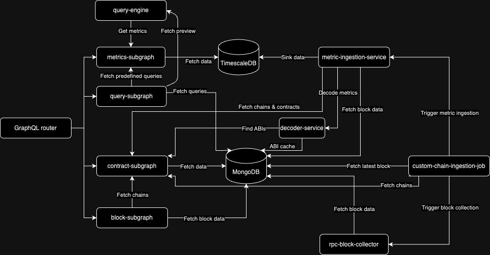

# Opentorch

Opentorch is a full-stack application to provide you with monitoring and observability for any blockchain.

## How do I run it?

Make sure you have docker-compose installed and Docker is running
```bash
docker-compose up
```

This will spin up the whole infrastructure.

## How to start monitoring a blockchain?

To start monitoring a chain, you need to add it to the application

```curl
curl --location 'http://0.0.0.0:8000/api/internal/chains' \
--header 'Content-Type: application/json' \
--header 'Authorization: Basic YWRtaW46YWRtaW4=' \
--data '{
    "network": "mainnet",
    "chain": "<HUMAN_READABLE_CHAIN_IDENTIFIER>",
    "name": "<CHAIN_NAME>",
    "rpcUrl": "<CHAIN_RPC_ENDPOINT>",
    "chainType": "EVM",
    "externalId": <EXTERNAL_CHAIN_ID_NUMERIC>,
    "externalIdHex": "<EXTERNAL_CHAIN_ID_HEX>",
    "explorerUrl": "<EXPLORER_URL>",
    "explorerApiUrl": "<EXPLORER_API_URL>",
    "collectionName": "blocks.custom_rpc",
    "blocksPerDay": 7000,
    "supportedInUi": true,
    "mainnet": true
}'
```

After adding a chain, the pipeline will start ingesting blocks from it.  

To start seeing data in the UI, add a contract from any added chain.

## Services



### query-engine
Calculates query results on chain metric data for periodically running monitors
### metric-ingestion-service
Extracts metrics from block data and sinks them to a metrics database (TimescaleDB)
### decoder-service
Decodes transactions, logs and errors
### block-subgraph
Fetches block data via graphql
### rpc-block-collector
Ingests block data from chain RPC
### metrics-subgraph
Handles metric queries
### query-subgraph
CRUD for creating periodic queries (monitors)
### custom-chain-ingestion-job
Triggers block ingestion for custom chains
### contract-subgraph
Handles CRUD for chains and contracts. Also responsible for debugging and simulations.
### graphql-router
Main gateway infront of service subgraphs
